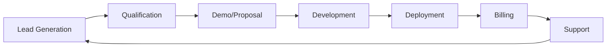

# 🚀 ESTRATEGIA DE OPTIMIZACIÓN DE INFRAESTRUCTURA Y PRODUCCIÓN
## Q1-Q4 2025 - De la supervivencia al crecimiento sistemático

---

## 📊 ANÁLISIS DE SITUACIÓN ACTUAL

### Recursos Disponibles:
- **Hardware Principal**: 8GB RAM (actualmente compartido)
- **Netbook Secundaria**: Para Chrome y tareas auxiliares
- **Monitor TV**: Puerto libre disponible
- **Sistema Operativo**: Ubuntu (optimizable)
- **Experiencia**: Emprendedor con SRL previa (Ceibo Group)

### Restricciones Críticas:
- Presupuesto limitado (no cubre gastos básicos)
- Necesidad de ingresos Q4 2025
- RAM compartida entre desarrollo y navegador
- Sin certificaciones formales actuales

---

## 🎯 OBJETIVOS ESTRATÉGICOS

### Corto Plazo (Q1 2025):
1. **Optimización máxima de recursos** (liberar 4GB+ RAM)
2. **Certificación Prompt Engineer** (Coursera)
3. **Primer MVP rentable** (generación inmediata de ingresos)

### Mediano Plazo (Q2-Q3 2025):
1. **2-3 MVPs funcionando** simultáneamente
2. **Red profesional activa** en LinkedIn
3. **Pipeline de clientes** establecido

### Largo Plazo (Q4 2025):
1. **Trabajo estable** o contratos recurrentes
2. **3-5 productos SaaS** generando ingresos
3. **Equipo o colaboradores** (opcional)

---

## 🔧 PLAN DE OPTIMIZACIÓN DE INFRAESTRUCTURA

### Fase 1: Separación de Recursos (INMEDIATA)
```bash
# Configuración de doble estación de trabajo
ESTACIÓN_PRINCIPAL="8GB RAM - Solo desarrollo y producción"
ESTACIÓN_AUXILIAR="Netbook - Chrome, investigación, comunicación"
```

### Distribución Optimizada:
1. **PC Principal (8GB)**:
   - VS Code + Terminal: 1.5GB
   - Docker containers: 2GB
   - Node.js/Python procesos: 2GB
   - Sistema base: 1.5GB
   - Buffer: 1GB
   
2. **Netbook (Chrome Station)**:
   - Chrome + 20 tabs: 2-3GB
   - Slack/Discord: 500MB
   - Música/multimedia: 500MB

### Configuración Multi-Monitor:
```bash
# Script para configurar dual display
xrandr --output HDMI1 --mode 1920x1080 --right-of LVDS1
# Netbook en TV, PC principal en monitor dedicado
```

---

## 💼 ESTRATEGIA DE MONETIZACIÓN "DONDE ESTÁ EL PIQUE"

### 1. NICHOS DE ALTO VALOR (El Pique Confirmado)
```
SECTOR                  | PROBLEMA               | SOLUCIÓN MVP
------------------------|------------------------|----------------
Inmobiliarias locales   | Sin automatización     | CRM simple
PyMEs manufactura       | Control de stock       | Sistema inventario
Profesionales salud     | Gestión de turnos      | Booking online
Comercios gastronómicos | Delivery sin comisión  | App propia
Educación/Cursos        | Plataforma propia      | LMS básico
```

### 2. ESTRATEGIA DE ENTRADA AL MERCADO
```
Semana 1-2: Identificación
- 10 empresas target por nicho
- Pain points específicos
- Presupuesto disponible

Semana 3-4: MVP Rápido
- Prototipo funcional en 72h
- Demo personalizada
- Pricing competitivo

Semana 5-6: Cierre
- Prueba gratuita 15 días
- Contrato mensual
- Soporte incluido
```

---

## 🛠️ BATERÍA DE PROMPTS PARA PRODUCCIÓN

### Para Trinity Cortex (Desarrollo Rápido):
```bash
# MVP en 24 horas
tcc "Generar estructura completa de [TIPO_APP] con auth, CRUD, 
     dashboard para [INDUSTRIA]. Stack: Next.js, Prisma, PostgreSQL. 
     Incluir docker-compose y scripts de deploy"

# Análisis de mercado
tcc "Analizar 10 competidores de [PRODUCTO] en Argentina. 
     Extraer: pricing, features, debilidades. Formato: tabla comparativa"

# Generación de propuesta comercial
tcc "Crear propuesta comercial para [EMPRESA] sector [INDUSTRIA].
     Problema: [PAIN_POINT]. Solución en 3 fases. Pricing mensual"
```

### Para Claude (Estrategia y Optimización):
```bash
# Optimización de código
"Revisar este código para reducir uso de memoria en 50%. 
 Mantener funcionalidad. Explicar cada optimización"

# Documentación técnica
"Generar documentación completa API REST. Incluir: endpoints,
 ejemplos curl, respuestas, códigos error, autenticación"

# Email de venta
"Email para CEO de PyME [INDUSTRIA]. Mostrar ROI de automatización
 [PROCESO]. Máximo 150 palabras. CTA para demo"
```

---

## 📈 SISTEMA DE PRODUCCIÓN SEMANAL

### Lunes - Martes: INVESTIGACIÓN
```bash
# Script de prospección automática
./find_leads.sh [INDUSTRIA] [CIUDAD] [TAMAÑO_EMPRESA]
# Genera lista de 50+ leads cualificados con contactos
```

### Miércoles - Jueves: DESARROLLO
```bash
# Generación rápida de MVP
./create_mvp.sh [TEMPLATE] [CLIENTE] [FEATURES]
# Deploy automático a servidor de demos
```

### Viernes: VENTAS
```bash
# Envío masivo personalizado
./send_proposals.sh [LISTA_LEADS] [TEMPLATE_PROPUESTA]
# Seguimiento automático
```

### Sábado: MEJORAS
```bash
# Optimización y actualizaciones
./update_all_projects.sh
# Backup y documentación
```

---

## 💰 PROYECCIÓN FINANCIERA REALISTA

### Q1 2025 (Supervivencia):
- **Objetivo**: AR$ 300.000/mes
- **Método**: 3 clientes × AR$ 100.000
- **Producto**: Mantenimiento web + pequeñas automatizaciones

### Q2 2025 (Estabilización):
- **Objetivo**: AR$ 500.000/mes
- **Método**: 5 clientes × AR$ 100.000
- **Producto**: MVPs personalizados

### Q3 2025 (Crecimiento):
- **Objetivo**: AR$ 800.000/mes
- **Método**: 8 clientes × AR$ 100.000
- **Producto**: SaaS con suscripción mensual

### Q4 2025 (Consolidación):
- **Objetivo**: AR$ 1.200.000/mes
- **Método**: 10 clientes recurrentes + trabajo remoto
- **Producto**: Portfolio diversificado

---

## 🎓 PLAN DE CERTIFICACIÓN Y NETWORKING

### Mes 1: Certificación Coursera
```
Inversión: US$ 49/mes
ROI esperado: 
- Credibilidad inmediata
- Acceso a red de profesionales
- Badge LinkedIn verificado
- Material de estudio estructurado
```

### Mes 2-3: LinkedIn Optimization
```
- Post diario sobre IA/Automatización
- 3 casos de éxito por semana
- Conectar con 50 personas/semana
- Participar en 5 grupos activos
```

### Mes 4-6: Posicionamiento
```
- Blog técnico (1 post/semana)
- GitHub con 10+ proyectos públicos
- Contribuciones open source
- Webinars mensuales gratuitos
```

---

## 🔄 CIRCUITO DE PRODUCCIÓN AUTOMÁTICO

### Pipeline Completo:


### Automatización del Pipeline:
```bash
# Cron jobs para automatización
0 9 * * 1 /home/scripts/weekly_leads.sh
0 10 * * 3 /home/scripts/send_proposals.sh  
0 9 * * 5 /home/scripts/follow_up.sh
0 0 1 * * /home/scripts/monthly_billing.sh
```

---

## 🚨 MÉTRICAS CLAVE (KPIs)

### Semanales:
- Leads generados: >50
- Propuestas enviadas: >10
- Demos realizadas: >5
- Conversión: >20%

### Mensuales:
- MRR (Monthly Recurring Revenue)
- Churn rate: <10%
- Customer Lifetime Value
- Costo de Adquisición

---

## 📝 CHECKLIST DIARIO

### Mañana (2 horas):
- [ ] Revisar métricas del día anterior
- [ ] Responder comunicaciones urgentes (netbook)
- [ ] Planning del día en Trello/Notion
- [ ] Optimización del sistema (`./optimize.sh`)

### Día (6 horas):
- [ ] Desarrollo/código (PC principal)
- [ ] Testing y debugging
- [ ] Documentación
- [ ] Deploy o actualización

### Tarde (2 horas):
- [ ] Prospección y ventas (netbook)
- [ ] Networking LinkedIn
- [ ] Estudio certificación
- [ ] Preparar día siguiente

---

## 🎣 FILOSOFÍA "DONDE ESTÁ EL PIQUE"

### Señales de un buen "pique":
1. **Presupuesto disponible**: Empresa ya gasta en el problema
2. **Dolor real**: El problema les cuesta dinero diariamente
3. **Decisión rápida**: Dueño o gerente toma decisiones
4. **Poca competencia técnica**: No hay desarrolladores internos
5. **Urgencia**: Necesitan solución YA

### Lugares donde buscar:
- Grupos de WhatsApp de empresarios locales
- Cámaras de comercio
- Asociaciones profesionales
- LinkedIn (filtrar por ciudad + industria + tamaño)
- Recomendaciones de clientes actuales

---

## 💡 CONCLUSIÓN Y PRÓXIMOS PASOS

1. **HOY**: Configurar netbook para Chrome, liberar RAM principal
2. **ESTA SEMANA**: Implementar scripts de automatización
3. **ESTE MES**: Conseguir primera certificación
4. **TRIMESTRE**: 3 clientes recurrentes mínimo

### Mantra de Trabajo:
"No es cuánto trabajo, es dónde lo aplico. 
Como en la pesca, voy donde está el pique,
no donde el río es más lindo"

---

*Actualizado: Enero 2025*
*Próxima revisión: Febrero 2025*
